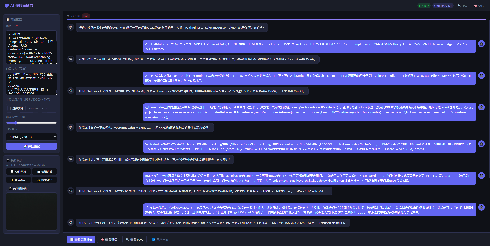
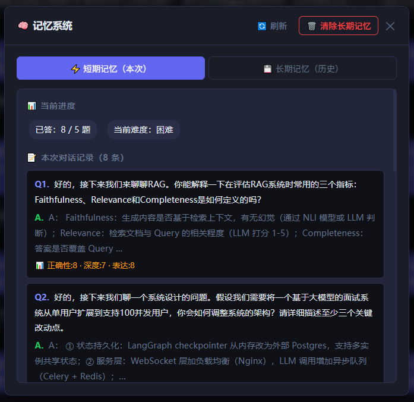
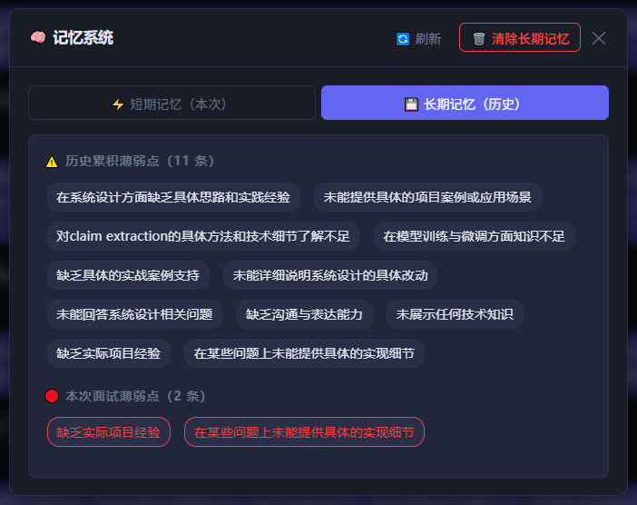
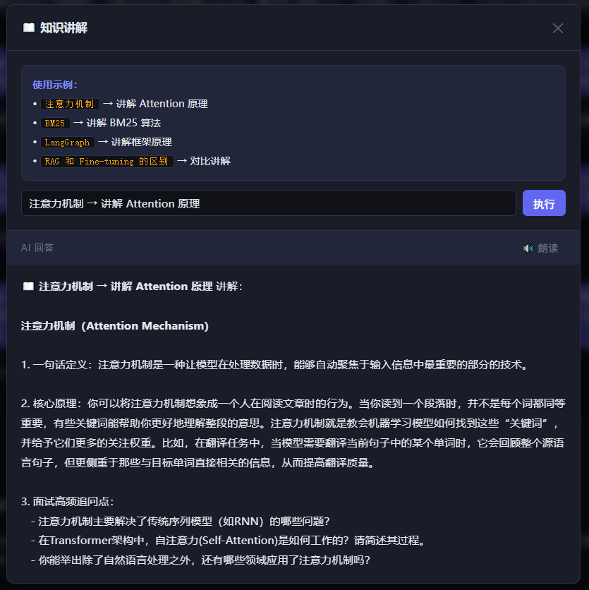
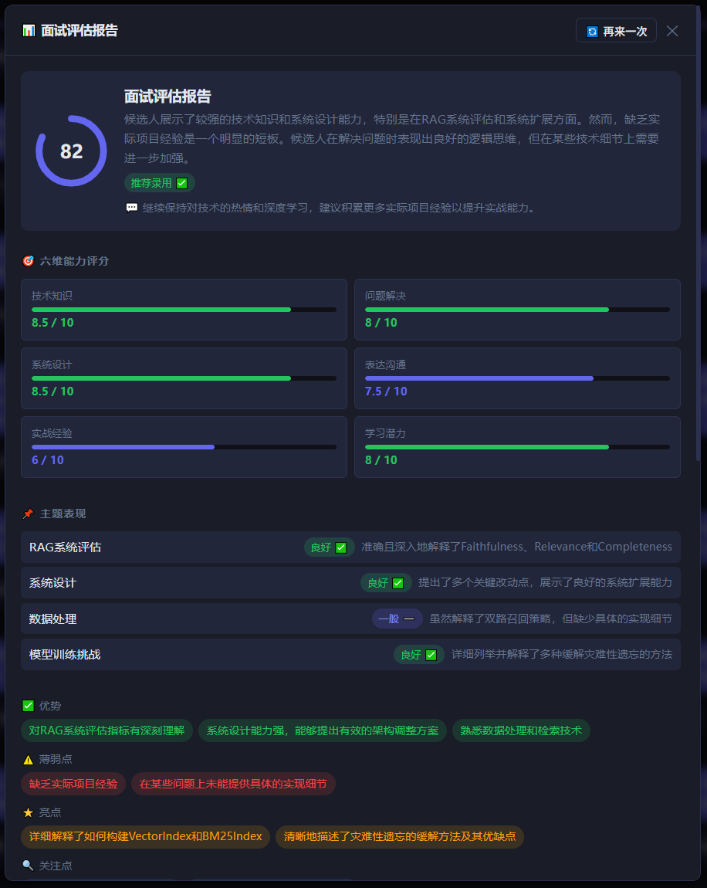
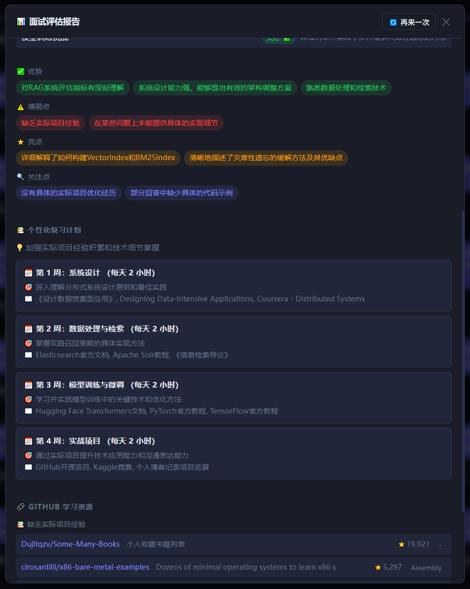
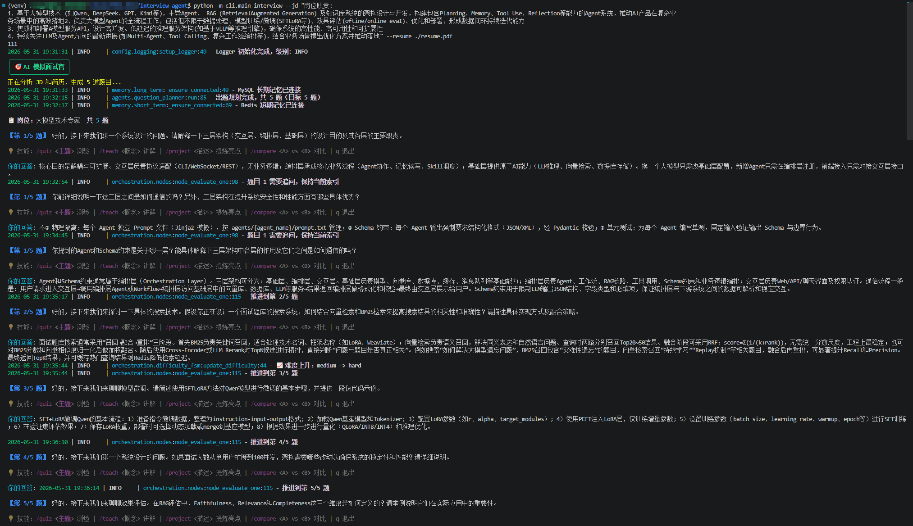
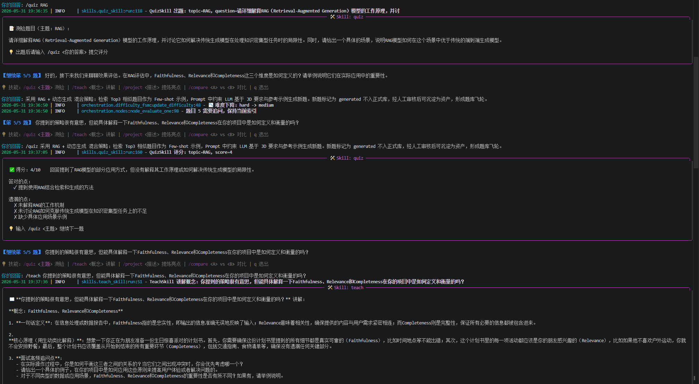
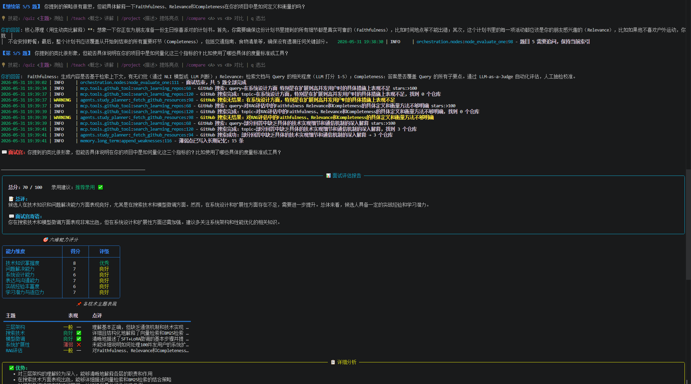
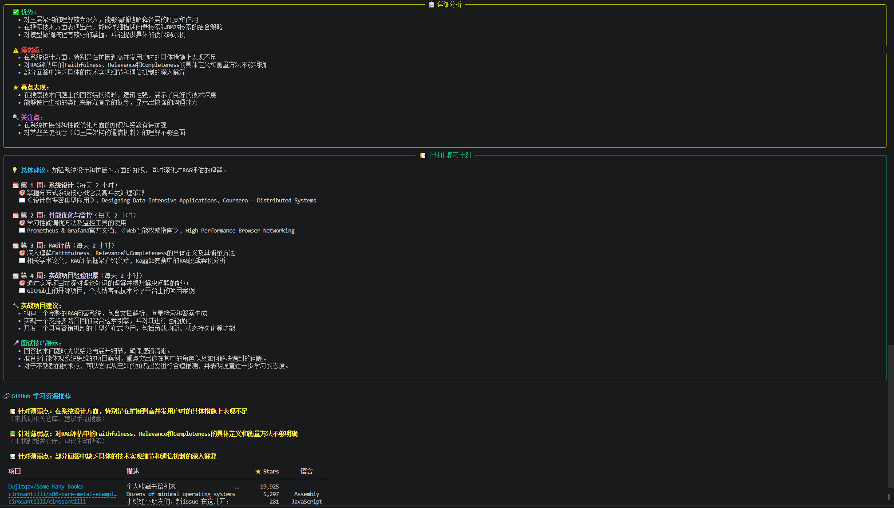

<div align="center">

# 请给我免费的star⭐吧，十分感谢！

# 🎯 InterviewAgent · AI 模拟面试官

**一个完整工程级的 AI Agent 应用**

上传简历 + 输入岗位 JD → AI 自动做一场完整的模拟面试 → 打分 → 出报告 → 制定复习计划

[](https://python.org)
[](https://github.com/langchain-ai/langgraph)
[](https://llamaindex.ai)
[](https://fastapi.tiangolo.com)
[](LICENSE)

<p align="center">
  
</p>


</div>

---

## 📖 目录

- [项目简介](#-项目简介)
- [八大核心技术亮点](#-八大核心技术亮点)
- [三层架构](#-三层架构)
- [面试流程 DAG](#-面试流程-dag)
- [项目结构](#-项目结构)
- [环境准备](#️-环境准备)
- [快速启动](#-快速启动)
- [API 文档](#-api-文档)
- [核心技术栈](#️-核心技术栈)
- [License](#-license)

---

## 🌟 项目简介

InterviewAgent 是一个**完整工程级**的 AI Agent 应用，集成了当前 AI 工程领域最主流的技术范式：

- 🤖 **多 Agent DAG 协作**：8 个专职 Agent，LangGraph 编排
- 🔍 **RAG 多路召回 + LLM Rerank**：向量 + BM25 双路，不是简单调向量库
- 🧠 **Agent 记忆系统**：Redis 短期 + MySQL 长期，跨会话记住你的薄弱点
- 🎚️ **动态难度调节**：三级难度状态机，模拟真实面试官策略
- 🧩 **Skill 技能系统**：有状态多轮交互能力模块，可插拔扩展
- 🔌 **MCP 协议集成**：标准协议接入外部工具
- 🎬 **完整工程交付**：Web 界面 + 摄像头 + STT + TTS 语音交互

---

## ✨ 八大核心技术亮点

### 🤖 1 · 多 Agent DAG 协作编排

不是一个 Prompt 走天下，而是 **8 个 Agent 各司其职**：

| Agent | 职责 |
|-------|------|
| `IntentRouter` | 意图识别与路由分发 |
| `JDAnalyzer` | 解析 JD，提取技术栈与职级要求 |
| `ResumeAnalyzer` | 简历匹配分析，识别候选人优劣势 |
| `QuestionPlanner` | 基于 JD + 简历规划题目分布 |
| `Interviewer` | 主持多轮面试，动态追问深挖 |
| `Evaluator` | 逐题打分，生成评估报告 |
| `StudyPlanner` | 制定个性化复习计划 |
| `ChatAgent` | 处理闲聊与引导性对话 |

通过 **LangChain + LangGraph** 框架编排 DAG 协作，每个 Agent 有独立的 Prompt 策略和工具集。

> 📄 核心文件：`orchestration/graph.py`

---

### 🔍 2 · RAG 多路召回 + LLM Rerank

```
用户问题
    │
    ├─► 向量检索（Weaviate）─────┐
    │                            ├─► RRF 融合去重 ─► LLM 精排 ─► Top-K 结果
    └─► BM25 关键词检索 ─────────┘
```

- **双路并行**：语义向量检索 + 关键词倒排检索，互补覆盖
- **RRF 融合**：Reciprocal Rank Fusion 算法融合两路结果
- **LLM 精排**：大模型对候选结果重新排序，保证最终质量
- **LlamaIndex** 管理整个检索管线

> 📄 核心文件：`rag/retrievers/hybrid_retriever.py`

---

### 📊 3 · RAG 质量评估体系

做 RAG 不做评估等于闭着眼开车。项目实现了**三维评估**：

| 维度 | 说明 |
|------|------|
| **Faithfulness（忠实性）** | 生成内容是否忠于检索到的上下文 |
| **Relevance（相关性）** | 检索结果与问题的相关程度 |
| **Completeness（完整性）** | 答案是否覆盖问题的关键要点 |

配套 **TopK 调优实验脚本**，用数据量化 RAG 管线表现，持续优化。

> 📄 核心文件：`rag/evaluator/rag_evaluator.py`

---

### 🧠 4 · Agent 记忆系统

```
当前会话 ──► Redis 短期记忆 ──► 上下文滑动窗口，实时管理对话轮次
    │
    └──► MySQL 长期记忆 ──► 用户画像、薄弱点标签、历史面试记录
                              ↑
                        下次面试时自动加载，针对薄弱点重点考察
```

- **Redis**：短期记忆，管理当前对话上下文，O(1) 读写
- **MySQL**：长期记忆，持久化用户画像与历史数据，支持复杂查询
- **SQLAlchemy ORM**：统一数据访问层

> 📄 核心文件：`memory/memory_manager.py`

<div align="center" style="display: flex; justify-content: center; gap: 20px;">
  
  
</div>

---

### 🎚️ 5 · 动态难度调节

基于**有限状态机（FSM）**实现三级难度自动调节：

```
        连续答对 N 题                连续答对 N 题
[Easy] ──────────────► [Medium] ──────────────► [Hard]
         ◄──────────────          ◄──────────────
          连续答错 N 题                连续答错 N 题
```

模拟真实面试官的提问策略，让难度与候选人水平动态匹配。

> 📄 核心文件：`orchestration/difficulty_fsm.py`

---

### 🧩 6 · Skill 技能系统

区别于无状态的 Tool 调用，**Skill 是有状态的多轮交互能力模块**：

| Skill | 功能 |
|-------|------|
| `QuizSkill` | 快速知识点测验，逐题追踪答题状态 |
| `ExplainSkill` | 知识点深度讲解，支持追问 |
| `ProjectHighlightSkill` | 挖掘候选人项目亮点，引导表述 STAR 法则 |
| `TechCompareSkill` | 技术方案对比分析，考察深度理解 |

所有 Skill 通过 **Skill Registry** 统一注册管理，支持插拔扩展。

> 📄 核心文件：`skills/skill_registry.py`

<div align="center" style="display: flex; justify-content: center; gap: 20px;">
  
</div>


---

### 🔌 7 · MCP 协议集成

通过 **Model Context Protocol（MCP）** 标准协议接入外部工具：

```
Agent ──► MCP Client ──► MCP Server（Stdio / SSE）
                              │
                    ┌─────────┴─────────┐
                    │                   │
             GitHub 工具            Web 抓取工具
          （分析开源项目）          （获取技术文档）
```

掌握下一代 AI 工具集成标准，工具即插即用。

> 📄 核心文件：`mcp/mcp_client.py`

---

### 🎬 8 · 完整工程化交付

生产级 Web 应用交付，支持完整的多模态交互：

```
浏览器
  ├─ 摄像头视频流 ──► WebRTC
  ├─ 麦克风音频  ──► faster-whisper ──► 文字（STT）
  └─ LLM 输出    ──► CosyVoice      ──► 语音播报（TTS）
```

> 📄 核心文件：`audio/stt.py` · `audio/tts.py`

<div align="center" style="display: flex; justify-content: center; gap: 20px;">
  
  
</div>

---

## 🏗️ 三层架构

```
┌──────────────────────────────────────────────────────────────┐
│                        用户交互层                             │
│   💻 CLI（typer）  🔌 WebSocket  🌐 REST API  🖥️ Web 前端    │
│              摄像头输入 · 语音输入 · 文本输入                  │
└──────────────────────────────────────────────────────────────┘
                              │
┌──────────────────────────────────────────────────────────────┐
│                      Agent 编排层                             │
│                                                              │
│   IntentRouter → JDAnalyzer → ResumeAnalyzer                │
│        → QuestionPlanner → Interviewer                       │
│        → Evaluator → StudyPlanner → ChatAgent               │
│                                                              │
│   ┌──────────────┬──────────────┬─────────────────┐         │
│   │ Skill 技能系统 │ Memory 记忆系统 │ Difficulty FSM  │         │
│   │ 4 个有状态模块 │ Redis + MySQL  │ 三级难度状态机   │         │
│   └──────────────┴──────────────┴─────────────────┘         │
└──────────────────────────────────────────────────────────────┘
                              │
┌──────────────────────────────────────────────────────────────┐
│                      基础能力层                               │
│                                                              │
│   🤖 通义千问 LLM      🔢 text-embedding-v3                  │
│   🗄️ Weaviate 向量库   🔤 BM25 关键词检索                    │
│   🔧 MCP 工具接入      💾 Redis + MySQL 双引擎存储            │
└──────────────────────────────────────────────────────────────┘
```

---

## 🔄 面试流程 DAG

> LangGraph StateGraph 编排，节点间通过共享 State 传递数据

```
START
  │
  ▼
[route] ── 意图路由 ──────────────────────────────────────────┐
  │                                                           │
  ├─ input_jd ──────► [jd_analyze] ──────────────────► END   │
  ├─ chat ───────────► [chat] ────────────────────────► END   │
  ├─ use_skill ──────► [skill_dispatch] ──────────────► END   │
  ├─ answer_question ► [evaluate_one] ──┐                     │
  │                                     │                     │
  └─ start_interview                    │                     │
          │                             │                     │
          ▼                             │                     │
    [load_memory]                       │                     │
          │                             │                     │
          ▼                             ▼                     │
    [rag_retrieve] ──────────────► [ask] ◄───────────────────┘
          │                         │  ▲
          ▼                         │  │ 循环：下一题
    [plan_questions]                │  │
                                    ▼  │
                             [generate_report]
                                    │
                                    ▼
                              [study_plan]
                                    │
                                    ▼
                             [save_memory]
                                    │
                                    ▼
                                   END
```

### 完整面试六步流程

```
1️⃣  JD 解析          2️⃣  简历匹配          3️⃣  RAG 检索
提取技术栈/职级    →   分析优劣势        →   题库双路召回
       │
       ▼
4️⃣  智能出题          5️⃣  多轮面试          6️⃣  评估报告
规划题目分布      →   实时追问深挖       →   打分 + 复习计划
```

---

## 📂 项目结构

```
interview-agent/
│
├── agents/                          # 🤖 核心 Agent 层（面试智能决策系统）
│   ├── __init__.py
│   ├── base_agent.py                # Agent 基类，定义统一接口与LLM调用能力
│   ├── chat_agent.py                # 闲聊/降级对话 Agent
│   ├── evaluator.py ⭐              # 答案评分与面试表现评估 Agent
│   ├── intent_router.py ⭐          # 用户意图识别与路由分发
│   ├── interviewer.py ⭐            # 面试主控 Agent（出题+追问）
│   ├── jd_analyzer.py ⭐            # JD解析（技术栈/职级提取）
│   ├── question_planner.py ⭐       # 面试题生成与分布规划
│   ├── resume_analyzer.py ⭐        # 简历解析与能力画像构建
│   └── study_planner.py ⭐          # 面试后学习计划生成
│
├── api/                             # 🌐 Web API 服务层（FastAPI）
│   ├── __init__.py
│   ├── main.py ⭐                   # FastAPI 入口与应用初始化
│   ├── middleware.py               # 请求中间件（日志/鉴权等）
│   ├── schemas.py                  # API 数据结构（Pydantic）
│   └── routers/
│       ├── __init__.py
│       ├── health.py               # 健康检查接口
│       ├── interview.py ⭐          # 面试流程核心 API
│       ├── upload.py ⭐             # 简历/JD 上传接口
│       └── websocket.py ⭐          # 实时面试 WebSocket 通信
│
├── audio/                           # 🎧 语音系统（STT/TTS）
│   ├── __init__.py
│   ├── audio_manager.py            # 音频流统一管理器
│   ├── stt.py ⭐                    # 语音转文字（Whisper）
│   └── tts.py ⭐                    # 文字转语音（语音播报）
│
├── cli/                             # 💻 命令行工具
│   ├── __init__.py
│   └── main.py ⭐                   # CLI 启动入口（本地面试模式）
│
├── config/                          # ⚙️ 配置中心
│   ├── __init__.py
│   ├── logging.py                  # 日志配置
│   └── settings.py ⭐              # 全局配置（LLM/DB/RAG等）
│
├── frontend/                        # 🌐 前端界面
│   ├── index.html ⭐               # 面试 Web UI 页面
│   └── static/
│       ├── css/
│       │   └── style.css          # 页面样式
│       └── js/
│           └── main.js ⭐          # 前端交互逻辑（WebSocket等）
│
├── mcp/                             # 🔌 MCP 工具协议层
│   ├── __init__.py
│   ├── mcp_client.py ⭐            # MCP 客户端（工具调用入口）
│   └── tools/
│       ├── __init__.py
│       ├── github_tool.py ⭐       # GitHub API 工具（项目分析）
│       └── web_scraper.py         # 网页抓取工具
│
├── memory/                          # 🧠 记忆系统（短期+长期）
│   ├── __init__.py
│   ├── long_term.py ⭐             # 长期记忆（MySQL用户画像）
│   ├── memory_manager.py ⭐        # 记忆统一管理器
│   ├── models.py                  # 数据库ORM模型
│   └── short_term.py ⭐           # 短期记忆（Redis上下文）
│
├── orchestration/                   # 🧩 DAG编排与状态机
│   ├── __init__.py
│   ├── difficulty_fsm.py ⭐        # 面试难度状态机（Easy/Medium/Hard）
│   ├── edges.py                   # DAG边定义（流程流转规则）
│   ├── graph.py ⭐                # LangGraph 主流程图
│   ├── nodes.py ⭐                # DAG节点实现（各阶段执行逻辑）
│   └── state.py ⭐                # 全局状态结构定义
│
├── rag/                             # 🔍 RAG 检索增强系统
│   ├── __init__.py
│   ├── indexer.py ⭐              # 文档索引构建（向量+BM25）
│   ├── query_engine.py ⭐         # RAG查询入口
│   ├── reranker.py ⭐             # LLM重排序模块
│   ├── evaluator/
│   │   ├── __init__.py
│   │   ├── metrics.py            # 评估指标定义
│   │   ├── rag_evaluator.py ⭐   # RAG效果评估系统
│   │   └── topk_experiment.py    # TopK参数实验
│   └── retrievers/
│       ├── __init__.py
│       ├── bm25_retriever.py ⭐  # 关键词检索
│       ├── hybrid_retriever.py ⭐ # 混合检索（BM25+向量）
│       └── vector_retriever.py ⭐ # 向量语义检索
│
├── scripts/                         # 🛠️ 工具脚本
│   ├── build_index.py             # 构建RAG索引
│   ├── check_env.py ⭐            # 环境检测脚本
│   ├── init_db.py                # 数据库初始化
│   └── start_services.sh         # 服务启动脚本
│
├── skills/                          # 🧩 Skill 插件系统
│   ├── __init__.py
│   ├── base_skill.py              # Skill基类
│   ├── compare_skill.py           # 技术对比Skill
│   ├── project_skill.py           # 项目分析Skill
│   ├── quiz_skill.py ⭐           # 问答测验Skill（有状态）
│   ├── skill_registry.py          # Skill注册中心
│   └── teach_skill.py             # 教学模式Skill
│
├── tests/                           # 🧪 测试模块
│   ├── test_agents.py             # Agent测试
│   ├── test_api.py                # API测试
│   ├── test_memory.py             # Memory测试
│   └── test_rag.py                # RAG测试
│
├── .env.example                     # 环境变量模板
├── .gitignore                      # Git忽略配置
├── alembic.ini                     # 数据库迁移配置
├── pyproject.toml                  # Python项目配置
├── README.md ⭐                    # 项目说明文档
├── requirements.txt                # 生产依赖
└── requirements-dev.txt            # 开发依赖
```

---

## ⚙️ 环境准备

### 前置依赖

| 依赖 | 版本要求 | 用途 | 验证命令 |
|------|----------|------|----------|
| Python | 3.10+（推荐 3.11/3.12） | 运行环境 | `python --version` |
| MySQL | 8.0+ | 用户画像、面试记录、长期记忆 | `mysql --version` |
| Redis | 6.0+ | 短期记忆（会话上下文） | `redis-cli ping` |
| Weaviate | 最新版 | 向量数据库，RAG 向量索引 | `curl http://localhost:8080/v1/.well-known/ready` |
| DashScope API Key | — | 通义千问 LLM + Embedding | — |
| GitHub Token | 可选 | MCP GitHub 工具 | — |
| FFmpeg | 可选 | 音视频格式转换（STT/TTS） | `ffmpeg -version` |

### 安装各依赖

<details>
<summary>📦 Python 3.11</summary>

```bash
# Ubuntu
sudo apt install python3.11 python3.11-venv

# macOS
brew install python@3.11
```

</details>

<details>
<summary>🗄️ MySQL 8.0</summary>

```bash
# Ubuntu
sudo apt install mysql-server
sudo systemctl start mysql

# 创建数据库与用户
mysql -u root -p
```

```sql
CREATE DATABASE interview_agent CHARACTER SET utf8mb4;
CREATE USER 'interview_agent'@'localhost' IDENTIFIED BY 'your_password';
GRANT ALL PRIVILEGES ON interview_agent.* TO 'interview_agent'@'localhost';
FLUSH PRIVILEGES;
```

</details>

<details>
<summary>⚡ Redis 6.0</summary>

```bash
# Ubuntu
sudo apt install redis-server
sudo systemctl start redis

# 验证
redis-cli ping   # 应输出 PONG
```

</details>

<details>
<summary>🗃️ Weaviate</summary>

```bash
# 方案 A：下载二进制本地运行（推荐，免 Docker）
wget https://github.com/weaviate/weaviate/releases/latest/download/weaviate-linux-amd64
tar -xvf weaviate-linux-amd64
./weaviate --host 0.0.0.0 --port 8080 --scheme http

# 方案 B：使用 Weaviate Cloud 免费套餐
# https://console.weaviate.cloud/
```

</details>

<details>
<summary>🔑 DashScope API Key（通义千问）</summary>

1. 前往 [阿里云 DashScope 控制台](https://dashscope.console.aliyun.com/)
2. 在「API-KEY 管理」页面创建 Key
3. 将 Key 填入 `.env` 文件

```bash
# 验证（替换为你的 Key）
curl -H 'Authorization: Bearer $DASHSCOPE_API_KEY' \
  https://dashscope.aliyuncs.com/compatible-mode/v1/models
```

</details>

<details>
<summary>🐙 GitHub Token（可选）</summary>

1. GitHub → Settings → Developer settings → Personal access tokens
2. 创建 classic token，勾选 `public_repo` 权限

```bash
# 验证
curl -H 'Authorization: Bearer $GITHUB_TOKEN' https://api.github.com/user
```

</details>

<details>
<summary>🎬 FFmpeg（可选，STT/TTS 需要）</summary>

```bash
# Ubuntu
sudo apt install ffmpeg

# macOS
brew install ffmpeg
```

</details>

### 配置文件 `.env`

```bash
cp .env.example .env
vim .env
```

```env
# ── 必须填写 ──────────────────────────────────────────
DASHSCOPE_API_KEY=sk-xxxxxxxxxxxxxxxx      # 通义千问 API Key
MYSQL_HOST=localhost
MYSQL_PORT=3306
MYSQL_USER=interview_agent
MYSQL_PASSWORD=your_password_here          # MySQL 密码
MYSQL_DATABASE=interview_agent

REDIS_HOST=localhost
REDIS_PORT=6379

WEAVIATE_HOST=localhost
WEAVIATE_PORT=8080

# ── 可选 ──────────────────────────────────────────────
GITHUB_TOKEN=ghp_xxxxxxxxxxxxxx            # GitHub Token（MCP 用）
```

### 知识库数据准备

将面试题库和技术文档放置在 `rag/knowledge_base/` 目录下：

```
rag/knowledge_base/
├── questions/
│   ├── python.md          # Python 面试题库
│   ├── system_design.md   # 系统设计题库
│   ├── algorithm.md       # 算法题库
│   └── behavior.md        # 行为面试题库
└── knowledge/
    ├── python_deep.md     # Python 深度知识
    └── distributed.md     # 分布式系统
```

> 💡 支持 `.md` / `.txt` / `.json` / `.pdf` 格式，每个文件可包含 `tech_stack`、`difficulty` 等 meta 数据

---

## 🚀 快速启动

### Step 1 · 克隆项目

```bash
git clone <repo-url>
cd interview-agent
```

### Step 2 · 创建虚拟环境并安装依赖

```bash
python -m venv venv
source venv/bin/activate      # Windows: venv\Scripts\activate
pip install -r requirements.txt
```

### Step 3 · 配置环境变量

```bash
cp .env.example .env
vim .env    # 填入 DASHSCOPE_API_KEY、MYSQL_PASSWORD 等
```

### Step 4 · 启动依赖服务

```bash
# 终端 1：确保 MySQL 运行
sudo systemctl start mysql

# 终端 2：确保 Redis 运行
sudo systemctl start redis

# 终端 3：启动 Weaviate
./weaviate --host 0.0.0.0 --port 8080 --scheme http
```

### Step 5 · 环境检查

```bash
python scripts/check_env.py
```

预期输出：

```
✅ Python 版本      3.11.x
✅ 必要依赖         全部已安装
✅ .env 文件        已配置
✅ MySQL 连接       localhost:3306
✅ Redis 连接       localhost:6379 (PONG)
✅ Weaviate 连接    localhost:8080
✅ DashScope API    可用
```

### Step 6 · 初始化数据库 & 构建 RAG 索引

```bash
# 初始化 MySQL 数据表
python scripts/init_db.py

# 构建向量索引（确保知识库文件已放置）
python scripts/build_index.py
```

### Step 7 · 启动应用

**CLI 模式**（适合快速体验）

```bash
python -m cli.main interview --jd "岗位职责:
1、基于大模型技术 (如Qwen、DeepSeek、GPT、Kimi等)，主导Agent、 RAG (RetrievalAugmented Generation) 及知识库系统的架构设计与开发，构建包含Planning、Memory、Tool Use、Reflection等能力的Agent系统，推动Al产品在复杂业务场景中的高效落地
2、负责大模型Agent的全流程工作，包括但不限于数据处理、模型训练/微调(SFTLoRA等)、效果评估(oftine/online evaI)、优化和部署，形成数据闭环持续迭代能力
3、集成和部署A模型服务APl，设计高并发、低延迟的推理服务架构(如基于vLLM等推理引擎)，确保系统的高性能、高可用性和可扩展性
4、持续关注LLM及Agent方向的最新进展(如Multi-Agent、Tool Calling、复杂工作流编排等)，结合业务场景提出优化方案并推动落地" --resume ./resume.pdf --total 10
```

<div align="center" style="display: flex; justify-content: center; gap: 20px;">
  
  
</div>

--

<div align="center" style="display: flex; justify-content: center; gap: 20px;">
  
  
</div>


**Web 模式**（完整功能，含语音 + 摄像头）

```bash
python cli/main.py serve --host 0.0.0.0 --port 8000
# 本机访问：http://localhost:8000
# 远程访问：http://<服务器IP>:8000
# 如需远程访问，开放防火墙：sudo ufw allow 8000
```

**一键启动**（自动拉起所有服务）

```bash
chmod +x scripts/start_services.sh
./scripts/start_services.sh
```

---

## 📖 API 文档

启动 Web 模式后，访问 FastAPI 自动生成的 Swagger 文档：

```
http://<服务器IP>:8000/docs
```

### 主要接口

| 方法 | 路径 | 说明 |
|------|------|------|
| `POST` | `/api/interview/start` | 启动一场面试 |
| `POST` | `/api/interview/chat` | 发送消息，获取面试官回复 |
| `GET` | `/api/interview/report/{session_id}` | 获取面试评估报告 |
| `WS` | `/api/ws/chat` | WebSocket 实时双向通信 |

### 示例：启动面试

```bash
curl -X POST http://localhost:8000/api/interview/start \
  -H "Content-Type: application/json" \
  -d '{
    "jd": "招聘 Python 后端工程师，5 年经验，熟悉 FastAPI/MySQL/Redis",
    "resume": "...(简历文本)..."
  }'
```

---

## 🛠️ 核心技术栈

| 分类 | 技术 | 用途 |
|------|------|------|
| **Agent 框架** | LangGraph · LangChain | Multi-Agent DAG 编排 |
| **RAG 框架** | LlamaIndex | 检索管线管理 |
| **LLM / Embedding** | 通义千问（DashScope） | qwen-max 推理 + text-embedding-v3 |
| **向量数据库** | Weaviate | 语义检索存储 |
| **关键词检索** | BM25 | 倒排索引关键词召回 |
| **短期记忆** | Redis | 会话上下文缓存 |
| **长期记忆** | MySQL · SQLAlchemy | 用户画像 & 历史持久化 |
| **Web 框架** | FastAPI | REST API + WebSocket |
| **语音识别** | faster-whisper | STT 语音转文字 |
| **语音合成** | CosyVoice | TTS 文字转语音 |
| **工具协议** | MCP | 外部工具标准接入 |
| **RAG 评估** | RAGAS | 三维质量评估 |
| **CLI** | typer | 命令行界面 |

---


## Star History

<a href="https://www.star-history.com/?repos=BMN-zyb%2FAI_InterviewerAgent&type=date&legend=top-left">
 <picture>
   <source media="(prefers-color-scheme: dark)" srcset="https://api.star-history.com/chart?repos=BMN-zyb/AI_InterviewerAgent&type=date&theme=dark&legend=top-left&sealed_token=fM4jfItX4IwA_6a-6e7PyhQzGO3gIozRiOkJNJ5WwyjVNjBCsaCpSyaU6ncn2uEfDKvxPbgYUPg8oo5fYv3Ayk3UPiUfcaXZ0bJM5kv70dOaOHjU8hwcTA" />
   <source media="(prefers-color-scheme: light)" srcset="https://api.star-history.com/chart?repos=BMN-zyb/AI_InterviewerAgent&type=date&legend=top-left&sealed_token=fM4jfItX4IwA_6a-6e7PyhQzGO3gIozRiOkJNJ5WwyjVNjBCsaCpSyaU6ncn2uEfDKvxPbgYUPg8oo5fYv3Ayk3UPiUfcaXZ0bJM5kv70dOaOHjU8hwcTA" />
   
 </picture>
</a>


# 代码部分由AI生成。


## 欢迎贡献代码，提出问题和建议。如果你发现了bug或者有新的功能想法，请提交一个Issue让我知道。你也可以通过Fork项目并提交Pull Request来贡献代码。 如果你喜欢这个项目，欢迎给它一个星星⭐，这是对我最大的支持！


# 如果你觉得我的开源项目对你有帮助，可以赞助我一杯咖啡嘛，十分感谢！！！


## 📝 License

[MIT](LICENSE) © 2026 InterviewAgent
